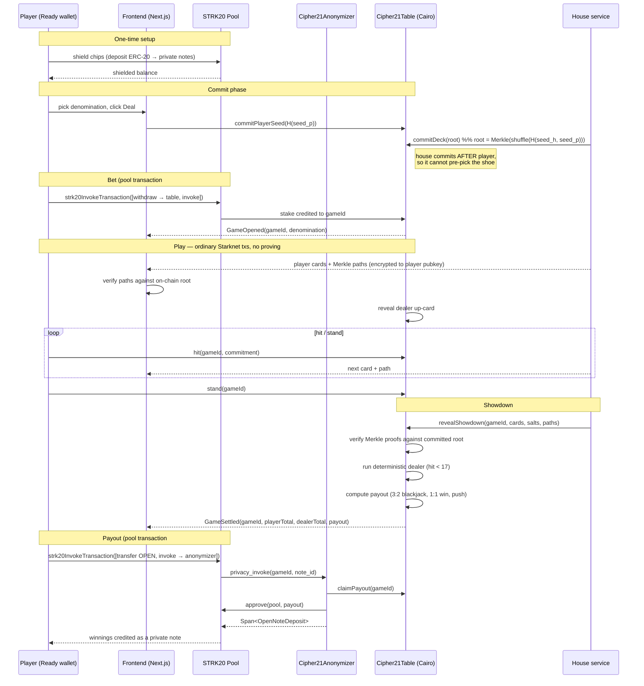

# Cipher21 · Starknet

**Confidential Blackjack on Starknet — hidden hands via commitments, shielded stakes via STRK20.**

Your hand is a commitment until showdown. The dealer's hole card is sealed behind a
deck the house committed to before you played. Your bets and winnings move through
the **STRK20 privacy pool**, so nobody watching the chain can tell that the wallet
at the table is yours.

> **Status: design.** This document is the architecture and the plan. No contracts
> are deployed and no code is written yet. Sections describing contracts and flows
> describe the *intended* build. See [Roadmap](#roadmap) for what exists.

> Successor to [**Cipher21**](../zama_hack) — Confidential Blackjack on the Zama
> Protocol (FHEVM), winner of Zama Mainnet Season 2. Same game, same pitch, an
> entirely different privacy stack.

---

## Table of contents

- [What changed, and why](#what-changed-and-why)
- [Why commit-reveal is honest *for blackjack*](#why-commit-reveal-is-honest-for-blackjack)
- [Privacy model](#privacy-model)
- [Architecture](#architecture)
- [A hand, end-to-end](#a-hand-end-to-end)
- [Contract surface (planned)](#contract-surface-planned)
- [Card encoding — a real shoe](#card-encoding--a-real-shoe)
- [Stack](#stack)
- [Project structure](#project-structure)
- [Getting started](#getting-started)
- [Roadmap](#roadmap)
- [Known limitations](#known-limitations)
- [Prior art](#prior-art)

---

## What changed, and why

The FHE version encrypted the *state itself*: cards lived on-chain as `euint8`
ciphertexts and the contract added, compared, and branched over them without ever
decrypting. Starknet has no equivalent primitive. STRK20 — the Starknet privacy
pool — hides **who paid whom and how much**; it does not give a contract secrets to
compute over. An anonymizer contract's `privacy_invoke` runs as ordinary public
Cairo.

The original pitch deck said it plainly: ZK hides *who did what*, not *what the data
is*. That critique applies to this build, so the architecture changes rather than
pretending otherwise.

| Layer | FHEVM (Cipher21) | Starknet (this repo) |
|---|---|---|
| Chip balances | ERC-7984 encrypted balances | **STRK20 shielded notes** — hides amount, sender, recipient, token |
| Your hand | `euint8` + `FHE.allow(card, you)` | Merkle commitment; revealed at showdown |
| Dealer hole card | No `allow` until stand | Committed in the deck root; revealed at stand |
| Randomness | `FHE.randEuint8(16)` on-chain | Two-sided commit-reveal → seeded shuffle |
| Dealer auto-play | `FHE.select` loop, gas-constant | Deterministic, verified on-chain at showdown |
| Showdown | `FHE.checkSignatures` on relayer proof | Merkle proofs verified in Cairo |
| Deck | Infinite, biased (1/16 vs 4/13) | **Real 52-card shoe, exact distribution** |

Two things get **better**: the money layer (STRK20 hides more than ERC-7984 did) and
the deck (a committed shoe has no distributional bias, so card counting actually
works). One thing gets **weaker**: the house learns the shoe at shuffle time. The
next section is why that turns out not to matter here.

---

## Why commit-reveal is honest *for blackjack*

In poker, "the house knows the deck" is fatal. In blackjack it is nearly harmless,
because **the dealer has no decisions to make.**

Dealer strategy is fully deterministic — hit below 17, stand at 17 or above. The
contract enforces that rule against the committed deck at showdown. A house that
knows the entire shoe still cannot deviate by a single card without failing
verification. There is no line of play for it to exploit.

Two-sided entropy closes the remaining gap. The player commits their seed **first**;
the house then commits the deck root derived from `H(seed_house, seed_player)`. The
house cannot pre-select a favourable shoe, because it does not know the player's
contribution when it commits — and it cannot change the shoe afterward, because the
root is on-chain before a single card is dealt.

This also dissolves a problem the FHE version had to engineer around. Its dealer
auto-play loop was carefully made gas-constant so the transaction shape would not
leak how many cards the dealer drew. Here, dealer play executes at `stand` — which
*is* the showdown — so there is nothing left to leak.

**What this does not give you:** an adversarial house that colludes with a player
could share the shoe. Mitigations are operational (commitment windows, rate limits),
not cryptographic. Full mental poker with commutative encryption would close it, at
a much larger build cost. Stated here rather than buried.

---

## Privacy model

| Data | Visible to |
|---|---|
| Your cards, during play | **You only** — chain holds a commitment |
| Your running total | **You only** |
| Your chip balance | **You only** — held as STRK20 notes |
| That *you* are the player at this table | **Nobody** — the pool→game hop carries no link to your wallet |
| Dealer face-up card | Public on deal |
| Dealer hole card | **Nobody** until you stand |
| Dealer hit decisions | Public at showdown (deterministic and verified) |
| Your cards, after showdown | Public — required to verify the payout |
| Bet amount | Public, but **denominated** — see below |
| Whether you won, and how much | Public — open-note amounts are plaintext |

### The two leaks, stated plainly

**1. The withdraw leg is public.** Moving chips from the pool to the game contract
reveals the amount and the recipient. The fix is **fixed bet denominations** (10 /
50 / 100): the amount is visible but uninformative when every player bets the same
units, and the hop carries no link back to you. Your anonymity set is everyone
betting that denomination.

**2. Open-note amounts are plaintext.** STRK20 open notes carry their amount in the
clear — that is what lets a helper credit a result it only learns at execution time.
So the *payout* is visible: an observer sees that some player won 1.5× a
denomination. They do not see **which** player.

Net: an observer can reconstruct the table's win/loss history. They cannot attribute
any of it to a wallet. That is a real privacy guarantee and a narrower one than FHE
gave — do not let a pitch blur the difference.

---

## Architecture

Two independent layers. The game never touches viewing keys; the pool never sees a
card.

```
┌─────────────────────────────────────────────────────────────────┐
│  MONEY LAYER — STRK20 privacy pool                              │
│                                                                 │
│  shield chips ──► private notes ──► bet (fixed denomination)    │
│                        ▲                      │                 │
│                        │                      ▼                 │
│                   open note ◄──── Cipher21Anonymizer            │
│                    (payout)        (privacy_invoke)             │
└────────────────────────────────┬────────────────────────────────┘
                                 │  settle(gameId, outcome)
┌────────────────────────────────▼────────────────────────────────┐
│  GAME LAYER — Cairo commitments                                 │
│                                                                 │
│  player commits seed ──► house commits deck Merkle root         │
│         │                                                       │
│         ├─ cards delivered off-chain, encrypted to player       │
│         ├─ hit / stand post commitments only                    │
│         └─ showdown: Merkle proofs verified, dealer auto-plays  │
└─────────────────────────────────────────────────────────────────┘
```

**Why the split.** Every STRK20 transaction carries a STARK proof, and a new note
needs a **10-block maturity window** before it is spendable. Proving is handled by
hosted services in wallet flows and its latency is machine-dependent when
self-hosted — either way it is far too slow to sit behind a `hit` button. A **flat
pool fee** applies per private operation on top of that, large enough that a small
stake can cost less than the fee to move. So the pool handles **buy-in** and
**cash-out** only, once per session; gameplay runs as ordinary fast Starknet
transactions. See [`STRK20_INTEGRATION_PLAN.md`](./STRK20_INTEGRATION_PLAN.md) §5.

The pool also permits **at most one `invoke` per transaction**, and the outcome is
unknown at bet time — so settlement is necessarily a second pool transaction. The
architecture does not fight this; it is built around it.

---

## A hand, end-to-end



---

## Contract surface (planned)

### `Cipher21Table` — the game

| Function | What it does |
|---|---|
| `commit_player_seed(commitment: felt252)` | Player commits `H(seed_p)`. Must land before the house commits. |
| `commit_deck(game_id, root: felt252)` | House posts the Merkle root of the shuffled shoe. |
| `open_game(game_id, denomination)` | Called via the anonymizer once the stake arrives from the pool. |
| `hit(game_id, card_commitment)` | Player takes a card; only the commitment goes on-chain. |
| `stand(game_id)` | Ends the player's turn, opens the showdown window. |
| `reveal_showdown(game_id, cards, salts, paths)` | Verifies every card against the root, runs the dealer, computes the payout. |
| `claim_payout(game_id)` | Anonymizer-only. Releases the payout for crediting into an open note. |
| `get_game(game_id)` | Public state: denomination, phase, card counts, revealed totals. |

### `Cipher21Anonymizer` — the STRK20 helper

Follows the standard `privacy_invoke` contract: returns exactly
`Span<OpenNoteDeposit>`, **approves** the pool rather than transferring to it, and
credits a **measured balance delta** rather than a trusted return value.

| Function | What it does |
|---|---|
| `privacy_invoke(game_id, token, pool_address, note_id)` | Pulls the settled payout from the table, approves the pool, returns the open-note deposit instruction. |

Asserts `pool_address == get_caller_address()` — the helper holds state, so it must
verify its caller is the pool.

### Chips

Bets are denominated in an ordinary Starknet ERC-20. **STRK20 shields any ERC-20**,
so unlike the FHE build there is no need for a bespoke confidential token — the
privacy comes from the pool, not the token. Chips are real STRK from the first
milestone — this build ends on mainnet, so there is no play-money faucet.

---

## Card encoding — a real shoe

The FHE version drew from an infinite deck: `FHE.randEuint8(16)`, whose power-of-two
bound forced a documented bias (Aces and pips at 1/16, ten-values at 7/16, against a
real shoe's 4/13). Commitments remove that constraint entirely.

```
deck    = fisher_yates(52 cards, prng_seed = H(seed_house, seed_player))
leaf_i  = H(card_i, salt_i)
root    = merkle(leaf_0 … leaf_51)
reveal  = (card_i, salt_i, merkle_path_i)
```

**Salts are load-bearing.** There are only 52 possible card values, so an unsalted
leaf is brute-forced instantly — anyone could unmask the hole card from the root. A
per-leaf random salt makes each leaf preimage-resistant.

Consequences: exact card distribution, a finite shoe, and therefore **card counting
that actually works** — a strictly better game than the FHE version, and a nice line
for the pitch.

---

## Stack

| Layer | Choice |
|---|---|
| Contracts | Cairo, `starknet` 2.18.0, Scarb workspace |
| Tests | `snforge` 0.63.0 |
| Privacy | STRK20 pool — **Mainnet and Sepolia only** (no devnet pool) |
| Wallet | `WalletAccountV6` via `starknet.js` 10.4.0 + `@starknet-io/get-starknet-discovery` 6.0.4 |
| Privacy wallet | Ready (Xverse support landing) |
| Frontend | Next.js 16.3.1, React 19.2, Tailwind 4 |
| Base | [`strk20-starter-kit`](https://github.com/Akashneelesh/strk20-starter-kit) |

The FHE build's frontend is Next 16 / React 19 / Tailwind 4, and the starter kit is
Next 16 / React 19 — so `src/components/{card,table,screens,landing}` port over
largely intact. `ethers` → `starknet.js`, `@zama-fhe/relayer-sdk` → the wallet API.
`_computePayout` and `_effectiveTotal` translate to Cairo almost line-for-line, and
get *simpler*: they already operated on plaintext at settlement time.

---

## Project structure

Checked boxes exist today; the rest arrive with the milestone that names them.

```
.
├── README.md                             ← you are here
├── STRK20_INTEGRATION_PLAN.md            ← route, privacy model, measured pool params
├── MILESTONES.md                         ← the five feature branches
├── cairo/                                ← Scarb workspace
│   ├── Scarb.toml                        ✓ M0
│   ├── snfoundry.toml                    ✓ M0
│   └── packages/cipher21/
│       ├── src/constants.cairo           ✓ M0  chips, buy-in tiers, fee headroom
│       ├── src/table.cairo                 M1  Cipher21Table — settlement, then rules
│       ├── src/anonymizer.cairo            M1  privacy_invoke helper (yours to audit)
│       ├── src/deck.cairo                  M2  Merkle verify + card decoding
│       ├── src/payout.cairo                M3  ported _computePayout / _effectiveTotal
│       └── tests/                        ✓ M0  snforge suite
├── house/                                  M2  shuffle + reveal service
│   ├── shuffle.ts                             seeded Fisher-Yates, Merkle root
│   └── reveal.ts                              per-card paths, encrypted to player
├── web/                                  ✓ M0  Next 16 · React 19 · Tailwind 4
│   └── src/
│       ├── app/                          ✓ M0
│       ├── components/                     M4  ported from ../zama_hack/web
│       └── lib/strk20.ts                   M4  wallet actions, denominations
└── scripts/
    ├── src/config.ts                     ✓ M0  pool + token addresses, RPC
    ├── src/pool-fee.ts                   ✓ M0  live pool parameters
    └── src/money-loop.ts                   M1  buy in → settle → cash out, on Sepolia
```

---

## Getting started

Toolchain — pinned in `.tool-versions`:

```
scarb 2.18.0      snforge/sncast 0.63.0      node 22
```

```bash
cd cairo   && scarb build && snforge test     # contracts
cd web     && npm ci && npm run build         # frontend
cd scripts && npm ci && npm run pool-fee      # live pool parameters, Sepolia
```

`npm run pool-fee -- mainnet` reads mainnet. Run it before setting any amount:
the pool charges a flat fee per transaction and that fee is what sets the buy-in
floor. It was 2 STRK on Sepolia and 6 STRK on mainnet on 2026-08-20, and the pool
owner can change it.

### A Sepolia account

Everything past M0 needs a funded Sepolia account to declare and deploy with.

```bash
cd cairo
sncast account create --network sepolia --name cipher21-deployer
# fund the printed address at https://starknet-faucet.vercel.app
sncast account deploy --network sepolia --name cipher21-deployer
```

`sncast` keeps the key in `~/.starknet_accounts/`, outside this repo. Leave it
there. Copy `.env.example` to `.env` for anything the scripts need — `.env` is
gitignored and nothing secret belongs anywhere else.

This is an ordinary Starknet account key. It is **not** a STRK20 viewing key —
Cipher21 never handles one of those, and no part of this repo should ever ask a
player for one.

---

## Roadmap

Five feature branches, each ending in a deployed address or a recorded transaction
hash. Full breakdown with entry criteria and definitions of done in
[`MILESTONES.md`](./MILESTONES.md).

| | Branch | What lands |
|---|---|---|
| **M0** | `chore/scaffold` | Scarb + `snforge` + `web/`, CI, funded Sepolia account, live pool fee measured |
| **M1** | `feat/money-loop` | Anonymizer + settlement core. Buy in, settle, cash out on Sepolia. *Nothing else starts until this works.* |
| **M2** | `feat/deck` | Seeded shuffle, salted Merkle leaves, Cairo verifier, real house service |
| **M3** | `feat/table` | Game state machine, dealer auto-play, ported payout math, house-timeout refund |
| **M4** | `feat/web` | Wallet connect, capability detection, shielded balance, session UI |
| **M5** | `feat/mainnet` | Audit gate, mainnet deploy, `strk20.json` complete |

**No mocks.** The pool exists on Mainnet and Sepolia only, so every pool-touching
path is tested on Sepolia against the real pool rather than stubbed.

---

## Known limitations

- **The house knows the shoe** after shuffling. Constrained, not eliminated — see
  [why that is acceptable here](#why-commit-reveal-is-honest-for-blackjack). Full
  mental poker would close it.
- **Payout amounts are public** (open notes are plaintext). Identity is not.
- **Bet amounts are public but denominated.** Free-form bet sizing would break the
  anonymity set.
- **The house is a live service.** It must be online to shuffle and reveal. An
  unresponsive house stalls a hand — needs a timeout-and-refund path so a player's
  stake is never trapped.
- **Proving latency, 10-block note maturity, and a flat per-operation pool fee.**
  Two pool transactions per *session*, not per hand. The UI must make the wait
  legible rather than hiding it behind a spinner.
- **Mainnet and Sepolia only** — there is no devnet STRK20 pool, so the pool leg
  cannot be exercised offline. Every flow that touches it is tested on Sepolia.
- **Not audited.** Hackathon code. The anonymizer holds funds mid-transaction and is
  exactly the kind of contract that deserves an audit before real money.

---

## Prior art

[**Cipher21 on FHEVM**](../zama_hack) — the original. Every card an FHE ciphertext,
the contract computing over encrypted state, ERC-7984 confidential chips. Live and
verified on Sepolia; winner, Zama Mainnet Season 2.

This repo is not a port. It is the same game rebuilt on a privacy stack with
different primitives and different guarantees — better on money, better on the deck,
weaker on hole-card secrecy. Both versions are honest about what they hide; they
simply hide different things.

**STRK20 references:** [docs](https://strk20.starknet.io) ·
[by example](https://strk20-by-example.org) ·
[SDK + pool](https://github.com/starkware-libs/starknet-privacy) ·
[starter kit](https://github.com/Akashneelesh/strk20-starter-kit)
